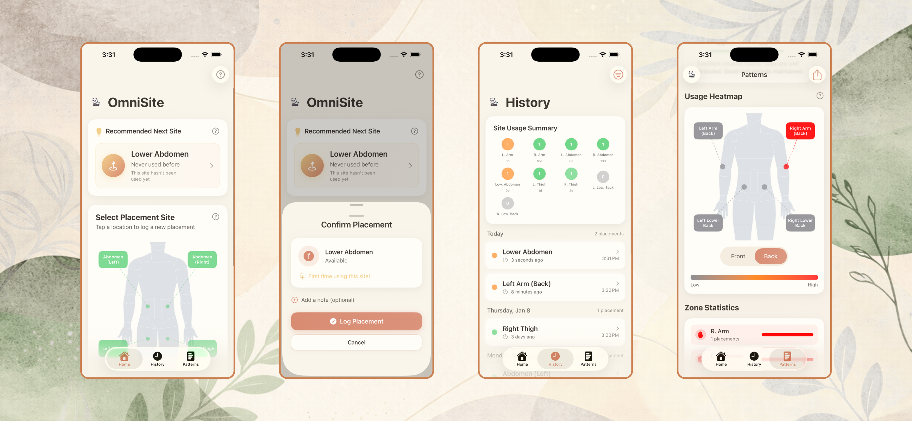

# OmniSite Tracker

A SwiftUI iOS app for tracking and rotating insulin pump placement sites. Designed for Type 1 Diabetes patients and caregivers to maintain healthy site rotation habits.


## Why Site Rotation Matters

For people living with Type 1 Diabetes who use insulin pumps (like the Omnipod), proper site rotation is critical for health and insulin effectiveness:

- **Prevents Lipohypertrophy** - Repeated injections in the same area can cause fatty lumps under the skin, which affects insulin absorption and can lead to unpredictable blood sugar levels
- **Maintains Insulin Absorption** - Fresh sites absorb insulin more consistently, leading to better glucose control
- **Reduces Scarring** - Rotating sites allows tissue to heal properly between uses
- **Extends Usable Sites** - Good rotation habits preserve all available placement areas for long-term pump use

Many pump users struggle to remember which sites they've used recently, especially caregivers managing a child's diabetes. OmniSite Tracker solves this by providing visual tracking and smart recommendations.

## Features

### Core Tracking
- **Interactive Body Diagram** - Visual front/back body views with corner-positioned zone buttons connected by dotted lines to body locations
- **Smart Recommendations** - Algorithmic suggestions for the next optimal site based on:
  - Days since last use at each location
  - Overall rotation balance across all sites
  - Preference for well-rested areas
- **Placement History** - Complete chronological log of all pump site changes with ability to edit or delete entries
- **Site Status Indicators** - Color-coded visual system:
  - Gray: Available (never used or fully rested)
  - Orange: Recent (used within recommended rest period)
  - Green: Rested (ready for use again)

### Patterns & Analytics
- **Heatmap Visualization** - Visual representation of site usage frequency across all body locations
- **Usage Analytics** - Track patterns over time to identify rotation habits and imbalances

### Customization
- **Custom Sites** - Add your own body sites with custom names and icons beyond the default locations
- **Configurable Rest Period** - Adjust minimum rest days (default: 18 days) to match your healthcare provider's recommendations
- **Site Management** - Enable/disable individual body sites to match your preferences or medical needs
- **History Display Preferences** - Option to show or hide disabled sites in History and Patterns views

### Notifications
- **Smart Reminders** - Get notified when sites become available again
- **Configurable Timing** - Set your preferred reminder time and how many days before a site is ready

### Modern UI Design
- Warm, earthy glassmorphism aesthetic with smooth animations
- Tab-based navigation: Home, History, Patterns, and Settings

## Supported Placement Sites

### Default Sites

| Front View | Back View |
|------------|-----------|
| Abdomen (Left) | Left Arm (Back) |
| Abdomen (Right) | Right Arm (Back) |
| Lower Abdomen | Left Lower Back |
| Left Thigh | Right Lower Back |
| Right Thigh | |

### Custom Sites
You can add unlimited custom body sites through Settings with personalized names and icons from a curated selection of SF Symbols.

## Screenshots



*From left to right: Home screen with body diagram and recommendations, Placement confirmation sheet, History view with usage summary, Patterns view with heatmap visualization*

## Requirements

- iOS 17.0+
- Xcode 15.0+

## Installation

1. Clone the repository:
   ```bash
   git clone https://github.com/yourusername/omni_location_tracker.git
   ```
2. Open `OmniSiteTracker.xcodeproj` in Xcode
3. Build and run on your device or simulator

## Architecture

- **SwiftUI** - Declarative UI framework with modern iOS 17 features
- **SwiftData** - Apple's native persistence framework for local storage
- **MVVM** - Clean Model-View-ViewModel architecture

## Project Structure

```
OmniSiteTracker/
├── Models/
│   ├── BodyLocation.swift        # Enum defining valid placement sites
│   ├── PlacementLog.swift        # SwiftData model for placement records
│   ├── UserSettings.swift        # User preferences (rest days, display options)
│   ├── CustomSite.swift          # User-defined custom body sites
│   ├── DisabledSite.swift        # Tracks which sites are disabled
│   └── NotificationSettings.swift # Reminder configuration
├── Views/
│   ├── HomeView.swift            # Main dashboard with body diagram
│   ├── HistoryView.swift         # Placement history with filtering
│   ├── PatternsView.swift        # Heatmap visualization and analytics
│   ├── SettingsView.swift        # App preferences and configuration
│   ├── ContentView.swift         # Tab-based navigation
│   └── Components/
│       ├── BodyDiagramView.swift          # Interactive body visualization
│       ├── HeatmapBodyDiagramView.swift   # Heatmap body visualization
│       ├── RecommendationCard.swift       # Smart site suggestion card
│       ├── PlacementConfirmationSheet.swift # New placement logging
│       └── PlacementEditSheet.swift       # Edit/delete existing placements
├── ViewModels/
│   ├── PlacementViewModel.swift  # Placement business logic
│   └── SettingsViewModel.swift   # Settings management logic
└── Utilities/
    └── DesignSystem.swift        # Colors, styles, and reusable components
```

## Contributing

Contributions are welcome! Please feel free to submit a Pull Request.

## Acknowledgments

- Designed with Type 1 Diabetes families in mind
- Icon features a friendly panda with an insulin pump

## License

MIT License - see [LICENSE](LICENSE) for details

## Disclaimer

This app is intended as a personal tracking tool and does not provide medical advice. Always consult with your healthcare provider regarding insulin pump site rotation and diabetes management.
